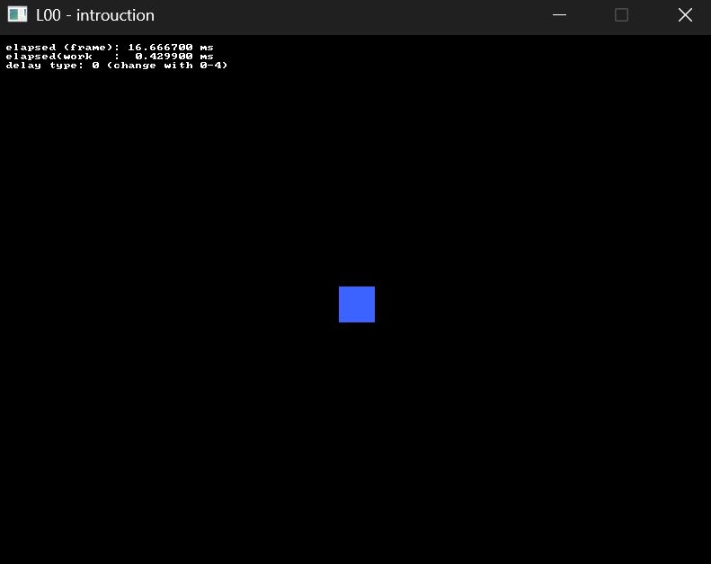

# Exercise 00 - Introduction

In this exercise we will learn the basic of an interactive C++ application and the usage of the SDL library.
This exercise will be very short by design. Take the time to
1. ensure that you are familiar with the basics of C and C++ programming
2. check that you can run everything in the `examples` folder
3. enjoy what's left of the summer

## References
This reposiroty is aready setup with a CMake project and all the instruction needed to run what you need.
Every file in the `exercise` folder will be its own standalone application, and in the future we will see how to create more complex projects.
The only thing to remember is to re-configure the CMake project after you add or delete any source or resource (ie images, fonts and so on). Check your IDE's documentation on how to do so.

A couple of useful API documentation links
- Generic C/C++ API: https://en.cppreference.com/w/
- useful SDL for this lecture
	- https://wiki.libsdl.org/SDL3/CategoryLog
	- https://wiki.libsdl.org/SDL3/CategoryTimer
	- https://wiki.libsdl.org/SDL3/CategoryRect

## 00.0 Hello SDL (Live Coding)
We will be togheter a simple interactive application with SDL, from scratch. We will focus on the basics:
- main loop
- logging and timing
- displaying a window
- user input
- placeholder rendering

## 00.1 Controlling a player
Starting from the live-coded example, move the "player" on the screen using the APIs showcased during the lab:
- read input/output from the WASD and move the "player" around
- depending how you implemented the movement, it could be very smooth and noce or jagged and unnatural. Think back the structure of the main loop and
  the input polling, how can you ensure smooth player movement?

## 00.2 Get Creative (optional)
If you really can't wait for next week, here are some extra ideas for stuff to do
- prevent the player from getting off-screen
- add a second player, with a different color, moved with the arrow keys
- check the API for different event type and try to read mouse button, mouse positions, or maybe even controllers
- have a few "NPC" rectangles moving on their own and report "gave over" whenever the player intersects one of them (hint for the intersection: check `SDL_FRect`'s API)
