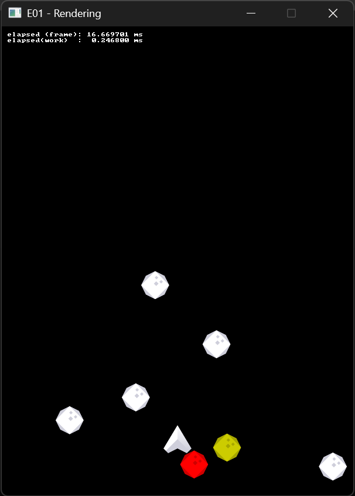

# Exercise 01 - 2D Rendering
In this exercise we will learn the basics of 2D rendering with SDL, as well as some _very_ simple memory management (or rather, how to avoid needing to worry about it
when we dont have to).

## References
- useful SDL for this lecture
	- https://wiki.libsdl.org/SDL3/CategoryRect
	- https://wiki.libsdl.org/SDL3/CategoryRender
	- https://wiki.libsdl.org/SDL3/CategorySurface

NOTE ON SDL_SURFACE: there should beno need to use this directly (except for the bits we will see togheter during the live coding). `SDL_Surface` is mostly used for
low-level image manipulation on the CPU. We just focus on `SDL_Texture` instead.

## 01.0 Live Coding
This live coding session will cover the basics of 2D, "client-side" rendering (ie, we won't be manipulating pixels and surfaces directly,
we will just focus on rendering images where we want them, the way we want them).
- stb libraries
- surfaces and textures
- texture tinting
- basic memory management considerations
- basic usage of C-style preprocessor directives

## 01.1 Shoot'em up
Starting from the live-coding example, turn it in an actual game
- add projectiles
  - create storage for them
	- you will need to choose an appropriate pool size
	- what happens if we don't have enough projectiles?
  - spawn them at player position on pressing spacebar
  - move them vertically at constant speed
  - if projectiles hits asteroid, despawn both
- add extra bits
  - player must be prevented to go outside the playing window. There are two main options, choose whichever you prefer
	- clamping (stop it to move further if too close to window borders)
	- wrapping (if the player would go outside the window borders, teleport it to the other side, pac-man style)
  - the player hits an asteroid, restart the game

## 01.2 Asteroids (optional)
Slightly change the mechanics of the game to turn it in the classic Asteroids
  - left and right rotate, back and forward move (check the `SDL_RenderTextureRotated` api in order to render the player appropriately)
  - asteroids have different sizes (hint: chech how we create the `rect_dst` struct) and spawn smaller ones when hit
  - all entities wrap around when reacing the window's edges

## 01.3 Vector math library (optional)
The rest of the exercise, especially the Asteroids part, makes some use of vector math. This will be our bread and butter later in the course, so it's worth preparing for them.
  - create a `vec2f` type that can hold all the data needed for a 2D vector
  - implement the vector math operations that we mentioned during the lecture
  - update the exercise using your `vec2f` type and your new operations

Then take a look at the code. How does it change? Is it easier or harder to read? What are the good and bad part of the design of your library?
If you want, you can also profile the two versions and see if you can find any meaningful difference. We will start talking abou performance in a few lectures,
but in the meantime the same functions we use for synchronizing the main loop should suffice (keep in mind that their resolution, altough being nanoseconds,
may be a bit too low for this kind of measurement. Higher resolution timers are a mess on modern architecturs to, and it can be tricky to interpret them.
If you want a sneak peak, check `SDL_GetPerformanceCounter`, `SDL_GetPerformanceFrequency`, and [Microsoft's QPC API](https://learn.microsoft.com/en-us/windows/win32/sysinfo/acquiring-high-resolution-time-stamps), which they model)