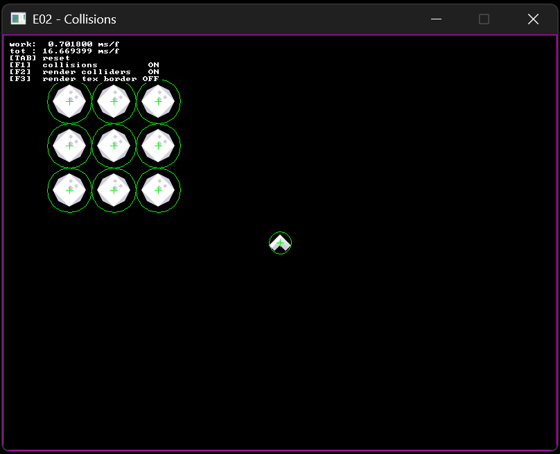

# Exercise 02 - Collisions
In this exercise we will learn the basics of collision detection with different kind of collision shapes, and collision separation.




## 01.0 Live Coding
This live coding session will get the simple circle<>circle collision that we hacked togheter last week,
structure it in a more general way and add collision separation.

**Note on the "performance" questions below: those are all back-of-the-envelope calculation style of questions. The precision we care about is in the order of magnitude of entities, milliseconds and so on. Feel free to actually profile the code if you want, but please take time to think about your code in an holistic way before.**

## 01.2 Optimizations (main)
Starting from the live-coding example, let's crank up the number of entities and see what happens.
- set the number of entities to something medium, 4096 is probably a good number
- after the existing asteroid intialization, keep spawning more in a loop until there are entities available.
  Spread them around (not necessary on screen, but it's better if they don't overlap)
- your ms/frame should skyrocket. Not good
	- if you are on an older laptop, you may want to lower the number and/or change the default `DEBUG_render_colliders` to `false`
	- if you are on a VERY powerful desktop, you may want to add some more?
  in either case, tweak the number ef entities until you reach something in the order of 200/300 ms/f. That's a good baseline to test some optimizations

Some optimizations to try:
- static colliders
	- add the ability to mark entities as "static". We could either store them in a different array or mark them with a boolean, we'll go with the boolean (less performant but requires less scaffolding. The important thing is to break the nasty quadratic loop we have.
	- how does this optimization affect separation? Would that make sense for a game? What if you prevent the static entity from moving?
	- did this fix our framerate problem? How many entities with static collision can you spawn before you exhaust your 16.6ms/f buget? How many to hit the previous 200/300 baseline?
- world partition
	- set back the asteroid entities to dynamic colliders (tune down entity number appropriately) and decrease their size (both collider and texture) so that they fit on the screen
	- since we don't have a camera system yet, out "game world" is pretty limited. Add a check for all entities in `game_update` and clamp their position so that they don't exit the window
	- create a set of `Entity*` array/pools to split our entities in different cells based on their position, without duplicating their data (you can hardcode the number of arrays to keep it simple, or use an array of arrays/make an array of dedicated data structures if you feel like it)
	- start with 4 cells (each cell is a quarter of the screen) and assign each entity to the correct quadrant. If an entity is in multple quadrant, add its reference in all of them
	- change the `collision_check` loop to test only entities in the same quadrant, for all quadrant
	- after collision separation (if active), some entities will have moved between cells. Update them
	- done! First prototype world partition algorithm
		- do you see a noticeable improvement?
		- how does performance change when you change the number and size of cells?
	- (optional) if you implemented dynamic pools, you can try one of the algorithms that we saw in class. I suggest trying the dynamic AABB trees: Erin Catto's explanation is extremely good (link in the slides), and the base algorithm is relatively simple if you skip the tree balancing.


## 01.3 Make it a game! (optional)
- add collectables to the game, using the appropriate sprite
	- you may want to add a way to mark them as triggers, so that collision separation is never performed when they are involved in the "collision"
- add additional info to entities to perform gameplay logic
	- an `alive` boolean to the entities, to handle spawning/despawning
	- an `EntityType` enum, to decide if a given entity is a player, an asteroid or a collectible
- both asteroids and collectibles move randomly in the screen window
	- similar to what we did with the player, you can have arrays of references to keep track of which entities need to have additional update processing. (IMPORTANT: do not reorder the entities, or your references will not be correct anymore. Pointers as "entity identifier" is a very crude solution, we'll see later how to create proper identifier and the acceleration structures that go with them)
```c++
struct GameState
{
	Entity*  entities;     // all entities, for fast update and rendering
	Entity*  player;       // reference to one specific entity in the `entities` array
	Entity** asteroids;    // array of references to the various asteroids. Their actual data resides in the `entities` array
	Entity** collectibles; // array of references to the various collectibles. Their actual data resides in the `entities` array
}
```
- after a collision is detected between two entities, decide how to handle it depending in the entity info
	- is it a trigger? No separation
	- what are the types of the entities involved?
		- player<>asteroid    => game_over
		- player<>collectible => increase score
		- asteroid<>collectible => nothing? Destroy collectible? Maybe the collectibe is not a trigger and they just bounce against each other

## 01.2 Box collision (optional)
Make the collision code more flexible, allowing for different kind of colliders
- add a tagged union that can hold both info for a circle (radius, offset) and rect (min, max)
- modify code to test circle<>circle, circle<>rect, rec<>rect
- add separation for rect<>rect
- add separation for rect<>circle
- (optional) add separation for rect<>rect (sounds pretty easy, but it's trick to decide how to perform the separation)
- (optional) add separation for rect<>circle (you will need to get the point overlap between the line segment and the circle)
