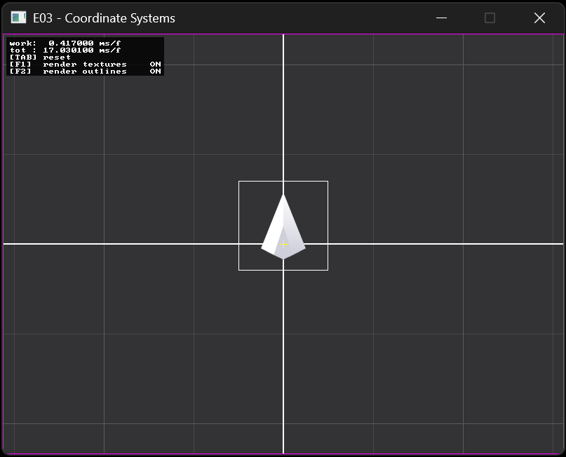

# Exercise 03 - Coordinate Systems
In this exercise we will setup a resolution-independent camera system and adapt the rest of our code to leverage it.

## 03.0 Live Coding
Create a screen-independent camera and world coordinate system.

## 03.1 Implement a simple Tilemap (main)
Use the information from the lecture and live-coding to implement a simple tilemap.
1. calculate the mouse position in world, camera and screen coordinates and log it to the screen (you can do the calculations yourself for practice, or you can use the utilities functions provided in `itu_lib_engine.hpp`)
1. change the texture atlas to `tiny_dungeon_packed.png`. You will also need to 
	1. change the camera's pixel unit size (a good choice is to have "1 world unit" == "pixel size of a single tile")
	1. cha the texture scaling mode to "nearest" when you create the texture
1. render tiles in a grid.
	1. you can either represent each tile as an individual entity OR have a single "tilemap" entity (what are the pro and cons of both?)
	1. set up a tile pattern to render (try to avoid vertical and horizontal symmetries, to be sure that you coordinates are coorect)
1. have the rest of the game interact with your tilemap
	1. add to your set mouse positions the coordinate of the tile currently under the mouse
	1. chenge the tint of the tile currently under the mouse
	1. change the tint of the tiles that overlaps with the player center/corners

## 03.2 Extras (optional)
- add npcs as entities that periodically move around in a random direction
- introduce the concept of player facing direction (how to represent it?)
- on pressing a button when facing an npc, something happens (they emote, you damage them, they start following you...)

## 03.3 Make a game out of it (optional)
- possible ideas
	- vampire survivor
	- katamari
	- snake
