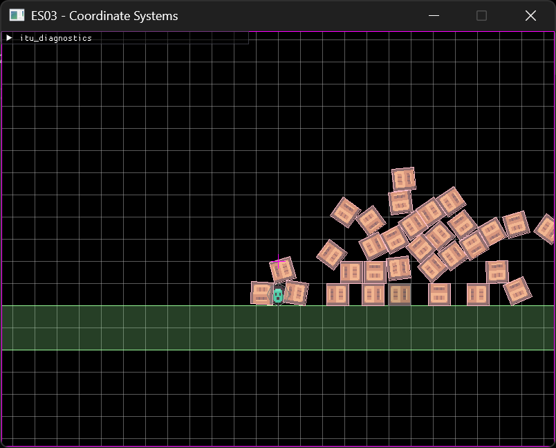
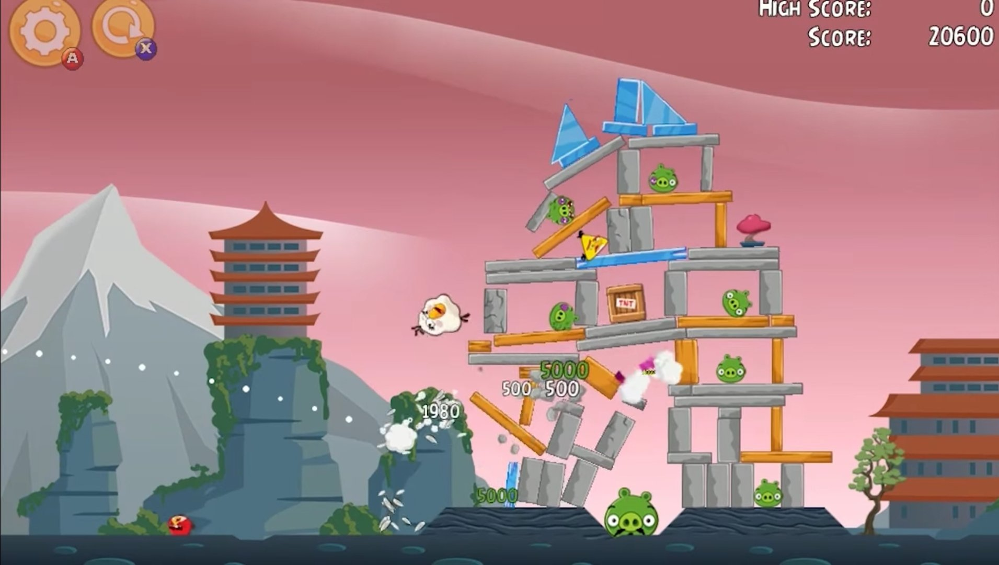
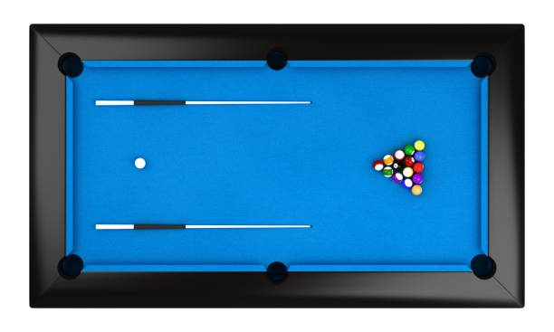

# Exercise 04 - Physics
This week's exercise will focus on leveraging physics simulation to achieve specific game mechanics/game feel.
If you are interested in more low-levle suff, some of the optional exercises will have you explore more advanced box2d feature,
and even implement some bais features from scrating on top of the collision detection exercise.



## 04.0 ~~Live Coding~~ Exercise Review
Review the basics of box2d integration
1. world stepping (simple)
1. world, body, shapes creation
1. game/physics interactions
1. debug draws

## 4.1 Make a game
I made s small selection of 3 games that you can try to implement to get a feel for what it means to integrate physics in your games, with focus on mainly 3 different aspects.
You can pick whichever ones your prefer to try. Graphics are not needed (but it's nice to see them).

### 4.1.1 Shooting Game
This game focuses on ballistic trajectories and physic material properties.
- create one of more static platforms for your game area and spawn a bunch of targets and/or obstacles
- have the player control angle, stenght and firing of a "cannon". On fire, spawn a projectile and sets its trajectory accordingly (either setting its velocity directly, or applying an appropriate impulse)
- create a firing loop where the player has to wait for the projectile to be despawned (either because it it something, it exited the play area, or it came to rest)
- (optional) add whatever scoring logic of your choice, moving elements, special projectiles, limited amount of tries...



### 4.1.2 Pools
This game focuses on dynamic entities and input interactions.
- create the game elements (edges of the play area, the target holes and balls) using colliders and triggers
- set up an input system that allows you to simulate the stick hitting the balls. You will need to derive from it 3 pieces of information
	- the point where the ball was hit
	- the direction in which the force will be applied
	- how strong the impact was
	you can try some free games online to see how intuitive inputs are implemented for this kind of game (most of them involve two player click, to get a starting point and a direction, where the force applied is proportional to distance between these two points)
- when a ball overlaps with a hole, despawn the former
- (optional) implement more rules to make it similar to the real game
	- points
	- two types of balls (white ball can be hit directly by the player but scores no points, other balls cannot be hit directly but count towards scoring)
	- two players




### 4.1.3 Platformer
This game focuses on kinematic movements and game feel.
- add moving kinematic (as `b2_kinematicBody` type) platforms to the game where the player can stand upon
- make the player slowly accelerate and decelerate instead of setting its speed immediately to max or zero
- add dashing (it's important to not teleport the player, but just set it speed to a high value for a few frames.)
- add enviromental hazards which reset the game when touched/overlapped
- (optional) add whatever additional feature/ability from your favourite platformer/metroidvania/whatever game might be relevant here


## 4.2 Advanced physics integration (optional)
The current physics integration is way too simple for a commercial game. We would like to address at least two things:
- physics is tied to the game update: updating the physics in the middle of our `game_update()`, togheter with the scaffolding code to update trasforms with the info from the physics simulation, is less than ideal. We would rather do actual game logic in `game_update`, run physics under the hood, and then react tp evantual collision info if we so choose. One possible way to address it would be something like:
```c++
// inside our main loop
game_update(&context, &state);
// update physics
{
	b2World_Step(state->world_id, TARGET_FRAMERATE_SECS, 4);
	// update transforms
}
game_update_post_physics(&context, &state);
```
- variable framerate: right now, we are stepping the box2d world at the same frequency we are *aiming* to run our game loop. This is fine when everything works, but if we skip our budget we will have a desync. What we would like to do is completely decouple the two: run the game as fast as we want/can, and then run however many number of physics steps to match. This is tricky to get correct, but you can check the excellent [Fix Your Timestep!](https://www.gafferongames.com/post/fix_your_timestep/) article to get a great head start.
**NOTE: this part of the exercise will be part of the discussion next week during the lecture, even if it's an optional one.**

## 4.3  basic physics to collision detection exercise (optional)
- assign every asteroid a random direction, move them at a constant speed
- when asteroid "hits" the edge of the screen, reflect its velocity relative to the edge normal (hint: no need for complex computation for this special case)
- when two asteroids hit each other, reflect their speed relative to the collision normal (this requires actual reflection, see `reflect(v, n)` in `itu_common.hpp`)
- add velocity damping (must be a very small factor) and/or elastic collision (factor that reduces speed on collision)
- add ways to add velocity back to the asteroids (ie, when mouse overlaps, add velocity in the direction `asteroid_center - mouse_pos`)
- compute the asteroids velocity based on forces applied to them

## 4.4 Add advanced physics to collision detection exercise (advanced)
Everything we did in exercise 02 and exercise 4.3 was all under the assumption that all our bodies behave as particles (no dimention, zero mass).
This is of course a gross simplification, and very limiting in the kind of games we can make (ie, the shooting game mentioned before would be pretty boring, and the pool one straight up impossible).
Adding dimensions to our bodies is not trivial tho. Amongs other things, we would need to:
- specify the object mass and center of mass
- allow forces to be applied at arbitrary points (instead on the center of mass, like we simplified so far)
- compute how much of a force will translate on a velocity change, and how much will translate to angular velocity change, which bring us to...
- adding angular velocity and torque support
And more. If you want to tackle this challenge, Allen chou has an [excellent series](https://allenchou.net/2013/12/game-physics-motion-dynamics-implementations/) that covers most of the basics.