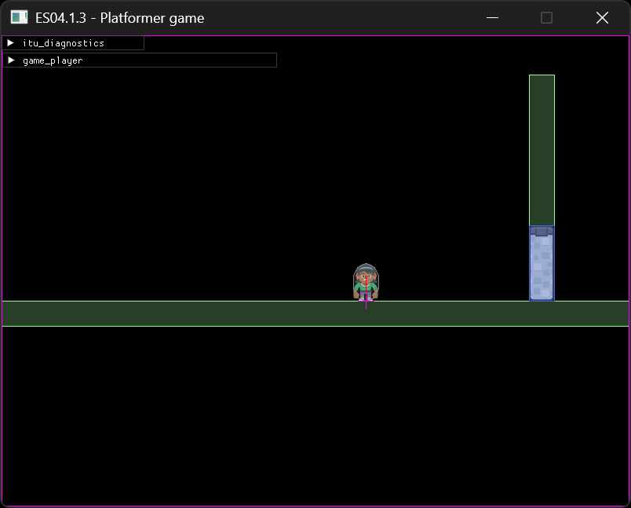

# Exercise 05 - Animation and Audio
This week we'll have a slightly easier exercise, focusing on sprite-based animation, easing and audio.

## 05.0 Exercise review
The review will focus on the API of SDL_mixer, and checking that everyone can run it properly. We will also look at some of the new functions and libraries added to the repo this week.

## 05.1 Sprite-based animation
- flip sprite based on movement direction
- when the player moves, cycle through the "walk" sprites (`character_femalePerson_sheet.xml` will tell you precisely where each frame is located)
- tweak the sprite animation speed based on the player horizontal velocity, in order to avoid feel sliding (you can change the values manually through the UI, but ideally we would like to express tha niamtion speed in function of the movement speed, so that everything still works with acceleration, within reasonable ranges)
- add frames for jump and fall, based on vertical movement speed

## 05.2 Linear interpolation and easing
- when the player is close enough to the "door", start to move it upwards linearly so that the gap is completely open after X seconds
- if the door is open, slide it down if the player is too far away
- apply  different kind of easing functions to the "open" and "close" animation.
	- Which ones work best?
	- How different easings affect the "personality" of the door? (ie, heavy/light, new/old, etc)

## 05.3 Audio
- move the current music to a track
	- make it looping
	- restart it when the game is reset
- add sound effects (SFX)
	- create a fixed number of tracks (8 or 16 are a good numbers) for SFX
	- whenever the walk animation shows a frame that looks appropriate, play a footstep sound on the first free track you find
	- whenever the door start opening/closing, play an appropriate SFX on the first strack you find
	- if there are no free tracks when you need to play the SFX, replace the oldest sound still playing (you may want to drop the number of tracks you create down to 1 or 2 to test this)