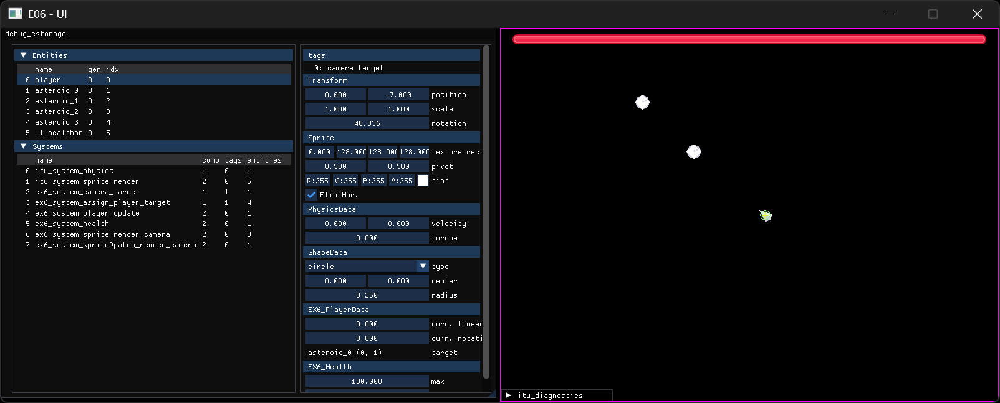

# Exercise 06 - UI

## 06.0 Exercise review
Here we will focus on the new data drive API, taking a look at how it works at a high level and at the debugginc capabilities. We will also briefly look into how we used ImGui to render the debug UI

## 06.1 Basic game UI
Just to test UI capabilities, we will create a simple button in our game:
- create a new struct called `EX6_UIImageButton` and register it to the engine
- create a function called `ex6_system_uiimagebutton(SDLContext* context, ITU_EntityId* entity_ids, int entity_ids_count)`, to check if the user clicked on top of an image
	- check how the other functions `ex6_system_XXX()` retrieve data from the entity storage. You will need to retrieve `EX6_TransformScreen`, `EX6_Sprite9Patch` and `EX6_ImageButton`
	- get the sprite's screen rectangle (check how it's done in `itu_lib_sprite_get_screen_rect` and adapt it)
	- you will also need to convert the mouse position from window screen to camera space, but for this there is the provided `point_window_to_screen()` function
	- finally, if the player clicked the mouse button AND the cursor is inside the sprite rectangle, you can execute whatever you want (log to console, for example)
- register this new function as a system, setting the correct component mask

## 06.2 Basic tool ui
Create a `ex6_debug_ui_render_uiimagebutton()` function
- show all the relevant data in the debug UI (see other functions in the exercise with `debug_ui_render` in the name)
- register it for the type `EX6_Sprite9Patch`

## 06.3 Rendering text (optional)
With the knowledge from the previous exercises, create a `EX6_UILabel` struct and use it to render text in game. In order to do so you'll need to use the [SDL_ttf](https://github.com/libsdl-org/SDL_ttf) library.
In order to use it, go to the `lib/SDL_tt` folder and on a console run the command `git submodule update --init --recursive` to download the 3rd partly libraries.

The most relevant API calls are:
- `TTF_Init()` init the library
- `TTF_LoadFont()` load a font from disk
- `TTF_CreateRendererTextEngine()` sets up the context to create text immediately renderable
- `TTF_CreateText()` converts a string to a renderable text object
- `TTF_DrawRendererText()` renders a text object at the desider coordinates

## 06.4 Tool UI meta-programming (advanced)
Manually creata and maitain ui widgets for all the various pieces of data in a game is cumbersome and error prone, especially when
dealing with gameplay data that change very frequently (if you are building an engine, you won't even know what data your users will create!).
Usually, functions like our `debug_ui_render` ones are automatically generated. If your code is in an higher-level lenguage, (ie, Unity uses C#,
Godot uses a custom scripting language) chances are that you will have access to type data at runtime and you can create those UIs on the fly with just a bit of metadata.

C/C++ however has famously poor support for that. Macros can only go so far and they are unhelpful in this case. Usually, the solution is transcompilation (ie, Unreal):
before compiling your code, run a small script that searches your source code for smecific tags and generates the source code for the UI.